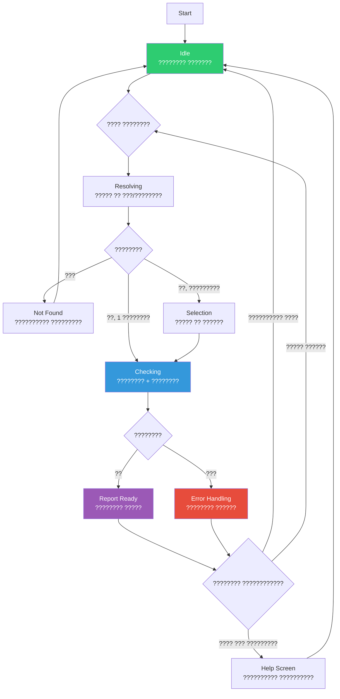

## ???? ?????????????? ? ????????-?????: ??????????????

---

### ?? ???????? ?????????????? ???????

| ??????? | ?????????? | ????? ????? |
|---------|------------|-------------|
| **????????????? ?????????** | ???????????? ????? ?????? ????????? ???, ? ?? ??? ??????? ????? | ???????? ??????????? ?????????? |
| **???????????? ????????** | ????????? ? ????????? ??????? ????????????? ? ???????? ??????? | ???????????? ?? ??????, ??? ??? ??????? |
| **?????????? ??????????** | ?????? ???????? ??????? ?????????? (?~7 ???????) | ??????? ?????? ??-?? ?????????? |
| **??????????? ??????** | ?????????? ? ?????? ?????? | ???????? ????????? ??? ????????? ?????? |

---

## ?? ???????? ??????? ????? ??????????????

### ??? 0: ????? ???? (`/start`)

```text
?? ???????????? ? ???????? ???????????? ?? 7 ??????

??? ? ????:
? ????????? ???????? ?? ???????? ??? ???/????
? ????? ??????????? ? ???????? ????
? ??????? ????????? ???????? ? ?????????????
? ??????? ?????? ??????? ? ????????????

?? ?????: ?????? ?????????? ???????? ??????. 
????????? ? ????????, ? ?? ??????????? ????????.

?? ??????? ???????? ???????? ??? ???/????:
```

**??????????? ??????????:**
```python
@router.message(Command("start"))
async def cmd_start(message: Message):
    welcome_text = """
?? <b>????????????</b> ? ???????? ???????????? ?? 7 ??????

??? ? ????:
? ????????? ???????? ?? ???????? ??? ???/????
? ????? ??????????? ? ???????? ????
? ??????? ????????? ???????? ? ?????????????
? ??????? ?????? ??????? ? ????????????

?? ?????: ?????? ?????????? ???????? ??????. 
????????? ? ????????, ? ?? ??????????? ????????.

?? ??????? ???????? ???????? ??? ???/????:
    """
    await message.answer(welcome_text, parse_mode="HTML")
```

---

### ??? 1: ????????? ??????? ?? ????????????

**???????? ?????:**
- `??????` ? ????? ?? ????????
- `7736207543` ? ????? ?? ???
- `1137847232852` ? ????? ?? ????

**????????? ???????????????:**
```text
??????? ????????? ???????? ? ??????? ?????????:

1?? ??? ???????? (??? 7736207543)
   ??????, ??-?????, 10 000+ ???????????

2?? ??? ???????.?????? (??? 7704431421)
   ??????, ?????????, 5 000+ ???????????

???????? ???????? ??? ???????? ??????:
```

**??????????? ??????????:**
```python
@router.message()
async def handle_company_query(message: Message, state: FSMContext):
    query = message.text.strip()

    # ???????? ??????? (???/????)
    if re.match(r"^\d{10}$|^\d{12}$|^\d{13}$|^\d{15}$", query):
        companies = await resolve_by_inn_ogrn(query)
    else:
        companies = await resolve_by_name(query)

    if len(companies) == 0:
        await message.answer("? ?? ??????? ???????? ?? ???????. ????????? ????????? ??? ?????????? ???/????.")
        return

    if len(companies) == 1:
        await start_checking(message, companies[0], state)
        return

    # ????????????? ?????
    kb = InlineKeyboardBuilder()
    for i, comp in enumerate(companies[:5], 1):  # ???????? 5 ?????????
        kb.button(
            text=f"{i}?? {comp['name_short']} (??? {comp['inn'][:6]}...)",
            callback_data=f"select:{comp['ogrn']}"
        )
    kb.adjust(1)

    await message.answer(
        "??????? ????????? ????????. ???????? ??????:",
        reply_markup=kb.as_markup()
    )
    await state.set_state(UserState.awaiting_selection)
```

---

### ??? 2: ???????? ????????? (???????? ???????!)

**?????????:** ????????????? **???? ? ?? ?? ?????????** ? ????????? ??????? ?????? ???????? ????????? ?????????.

```text
?? ???????? ???????? ?????? ?????????????...

?????????? 0% ? ?????? ? ???...
```

? ????? 1 ??? ? 

```text
?? ???????? ???????? ?????? ?????????????...

?????????? 25% ? ?????? ???????? ???...
```

? ????? 1 ??? ? 

```text
?? ???????? ???????? ?????? ?????????????...

?????????? 60% ? ???? ???????? ?? 90 ????...
```

? ????? 1 ??? ? 

```text
?? ???????? ???????? ?????? ?????????????...

?????????? 90% ? ???????????? ??????...
```

? ????? 1 ??? ? **?????? ?? ????????? ?????**

**??????????? ??????????:**
```python
class ProgressMessage:
    """????????? ????????? ????????? ????? ?????????????? ?????????"""

    STATUSES = [
        ("?????? ? ???...", 20),
        ("?????? ???????? ???...", 45),
        ("???? ???????? ?? 90 ????...", 70),
        ("???????????? ??????...", 95),
    ]

    def __init__(self, bot: Bot, chat_id: int, company_name: str):
        self.bot = bot
        self.chat_id = chat_id
        self.company_name = company_name
        self.message_id: Optional[int] = None
        self.current_step = 0
        self.lock = asyncio.Lock()

    async def show(self):
        """???????? ?????????????? ????????? ? ??????????"""
        text = self._build_progress_text(0, "?????????????...")
        msg = await self.bot.send_message(
            chat_id=self.chat_id,
            text=text,
            parse_mode="HTML"
        )
        self.message_id = msg.message_id

    async def update(self):
        """???????? ???????? ?? ?????????? ????"""
        async with self.lock:
            if self.message_id is None or self.current_step >= len(self.STATUSES):
                return

            status_text, percent = self.STATUSES[self.current_step]
            text = self._build_progress_text(percent, status_text)

            try:
                await self.bot.edit_message_text(
                    chat_id=self.chat_id,
                    message_id=self.message_id,
                    text=text,
                    parse_mode="HTML"
                )
            except TelegramBadRequest as e:
                if "message is not modified" not in str(e):
                    raise

            self.current_step += 1

    async def complete(self, final_text: str):
        """???????? ???????? ?? ????????? ?????"""
        if self.message_id:
            # ???????????? ????? ?? 4096 ???????? (????? Telegram)
            if len(final_text) > 4096:
                final_text = final_text[:4090] + " [...]"

            await self.bot.edit_message_text(
                chat_id=self.chat_id,
                message_id=self.message_id,
                text=final_text,
                parse_mode="HTML",
                reply_markup=self._build_final_keyboard()
            )

    def _build_progress_text(self, percent: int, status: str) -> str:
        filled = "?" * (percent // 10)
        empty = "?" * (10 - percent // 10)
        return (
            f"?? ???????? ???????? ?{self.company_name}?...

"
            f"<code>{filled}{empty}</code> {percent}% ? {status}"
        )

    def _build_final_keyboard(self) -> InlineKeyboardMarkup:
        kb = InlineKeyboardBuilder()
        kb.button(text="?? ????????? ???", callback_data="restart")
        kb.button(text="?? ??? ??? ????????", callback_data="how_it_works")
        kb.adjust(2)
        return kb.as_markup()
```

**?????????? ? ???????? ??????????:**
```python
async def start_checking(message: Message, company: dict, state: FSMContext):
    # ????????? ????????? ??? ??????
    await state.update_data(checking=True, company_ogrn=company["ogrn"])

    # ?????????? ????????
    progress = ProgressMessage(
        bot=message.bot,
        chat_id=message.chat.id,
        company_name=company["name_short"]
    )
    await progress.show()

    # ????????? ???????? ? ???? ? ??????????? ?????????
    async def background_check():
        try:
            # ??? 1: ?????? ? ???
            await asyncio.sleep(0.8)
            await progress.update()

            # ??? 2: ???????? ????
            await asyncio.sleep(1.2)
            await progress.update()

            # ??? 3: ???????
            await asyncio.sleep(1.5)
            await progress.update()

            # ??? 4: ????????? ??????
            report = await generate_company_report(company["ogrn"])
            await progress.update()

            # ?????: ???????? ?????
            await progress.complete(report)

        except Exception as e:
            error_text = (
                "? ?????? ??? ???????? ????????

"
                f"???????: {str(e)[:100]}

"
                "?????????? ????? ??? ????????? ?????? ????????."
            )
            await progress.complete(error_text)

    # ????????? ??????? ?????? ??? ???????? (???????????? ?? ????)
    asyncio.create_task(background_check())
```

---

### ??? 3: ????????? ?????

**?????? ?????? (?????? ??? ecom.tech):**

```text
? ????? ?? ????????: ??? ?????? ????????????? (ecom.tech)

?? ????: 1137847232852 | ???: 7811554010
?? ??????: ??????????? ?????? (? 19.06.2013)

?? ???????? ?????:
? ?? ???????? ?????????? (~20% ??-???????????? ? 2024?2025)
? ?? ??????????? ?? ??????? ????????? (???????? ?????????)
? ?? ??????????? ???????? ??????? (21 762 ?) ??? ???????????????? ???????

? ?????????? ???????:
? ??? ?????????? ? ?????? ????
? ?????? 1 ???????? ???? (? ???? ?????)
? ???????? ? ???????? ???????? ? ??????????

?? ????????? ???????:
? ????? ????????? 20% ??-???????????? ? Ecom.tech? (???????????, 15.01.2025)
? ?Ecom.tech ????????? ?????????? ???????? ? ???????????? (?????????, 03.12.2024)

?? ???????????? ????? ??????????? ????????:
1. ???????? ? ?????????: ??????? ?? ???????? ? ???? ??????????? 2025??
2. ????????? ?????? ??????? ??????????? ? ???????? ??????? (????????, ??????????? ? Telegram)

?? ?????????: ???, ?????, ????????? ??????????? ???, ??????.???????
?? ?????? ????????? ?? 29.01.2026. ?????? ?? ???? ??????????? ????????.
```

**? ???????? ??? ??????????:**
```
[?? ????????? ???]  [?? ??? ??? ????????]
```

---

### ??? 4: ????????? ?????? ? ?????????

| ???????? | ????????? ???????????? | ???????? |
|----------|------------------------|----------|
| **??????? ??? (>10 ???)** | `?? ??? ???????? ??????????. ???????? ???????... (2/3)` | 3 ??????? ? ???????????????? ????????? |
| **??? ?????? ? ????????** | `?? ?? ???????? ??? ?????? ? ???????? ????????. ????????? ??? ??? ????????.` | ?????????? ?????????????? ????? |
| **?????? LLM** | `?? ?? ??????? ???????????? ?????. ????????? ????? ??????:` + ??????? | ????? ? ?????????????????? ?????? ??? ????????? |
| **?????????? ???????** | `? ??????? ????????. ??? ?????? ?42 ? ???????. ???????? ~15 ???...` | ??????? ????? Redis ? ??????????? |

**??????????? ?????????? ?????????:**
```python
async def safe_api_call(func, *args, timeout=10, retries=3):
    for attempt in range(retries):
        try:
            return await asyncio.wait_for(func(*args), timeout=timeout)
        except asyncio.TimeoutError:
            if attempt == retries - 1:
                raise
            await asyncio.sleep(2 ** attempt)  # ???????????????? ????????
```

---

## ?? ????? ????????? ???????????? (FSM)



---

## ?? ??????????? ?????? ??????????

### 1. ??????????? Telegram API

| ??????????? | ??????? |
|-------------|---------|
| **4096 ???????? ? ?????????** | ???????? ????? + ???????? ` [...]"`; ??? ??????? ??????? ? ????? ????????? ? ??????? ??????? |
| **??????? ?????????????? (~1 ???/???)** | ???????????? `asyncio.sleep(1.0)` ????? ???????????? ????????? |
| **?????????? `MessageNotModified`** | ??????????? `edit_message_text` ? try/except ? ???????????? ??? ?????????? |
| **??????????? ?? ?????? (100 ??????/?????????)** | ???????????? ????????? ??? ??????? ???????? |

### 2. ????????? ?????? ?????????????

```python
@router.callback_query(F.data == "cancel_check")
async def cancel_check(callback: CallbackQuery, state: FSMContext):
    data = await state.get_data()
    if data.get("checking"):
        await state.update_data(cancel_requested=True)
        await callback.answer("???????? ????????", show_alert=True)
        await callback.message.edit_text(
            "? ???????? ???????? ?????????????.

?? ??????? ????? ????????:",
            reply_markup=None
        )
```

### 3. ??????????? ??? ????????? ????????? ????????

```python
# ? redis_cache.py
async def get_cached_report(ogrn: str) -> Optional[str]:
    key = f"report:{ogrn}"
    cached = await redis.get(key)
    if cached and (datetime.now() - datetime.fromisoformat(cached["timestamp"])) < timedelta(hours=24):
        return cached["report"]
    return None

async def cache_report(ogrn: str, report: str):
    await redis.setex(
        f"report:{ogrn}",
        86400,  # 24 ????
        json.dumps({"report": report, "timestamp": datetime.now().isoformat()})
    )
```

---

## ? ???-???? ???????? ???????

- [ ] ???????????? ?????? ????????, ??? ?????? ?????? (??? ????????? ?????????)
- [ ] ???????? ??????????? ?? ???? ??? ??? ? 2 ???????
- [ ] ??? ????????? ???????? ?????????? ?? ???????????? ??????
- [ ] ?????? ?????????????? ????????? (??? ????????? ????)
- [ ] ?????????? ???????? (>3 ???) ?????? ?????????????? ??????????
- [ ] ?????? ?????????? ???? ? ???? ??? ????????? ???????? ? ????????? ??????
- [ ] ??? ?? ? ????? ???????????? ?????? ???????????? ? ??????
- [ ] ??? ?????? ???????????? ??? ????????? ?????????? (???????? ??????)

---

??????, ????? ?:
1. ?????? **?????? ??? ???? ?? aiogram 3.x** ? FSM ? ???????????
2. ???????, ??? **????????????? ?????? ?????????? ????? ? PDF?**?
3. ????????????? **???????? ???????????** ??? ???????? ???????? ?? ??????? API?
