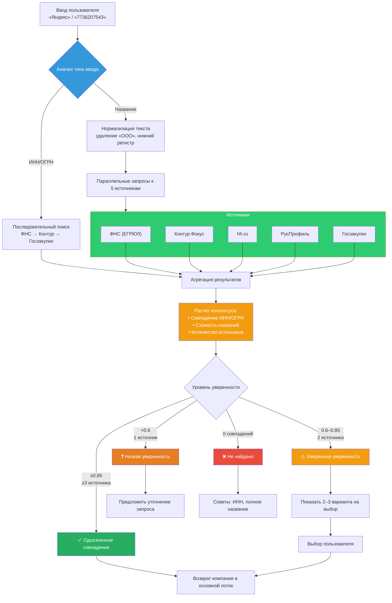

# Система разрешения сущностей компании: мультисурсовый подход  
*Документация архитектуры для сервиса проверки работодателей*

**Версия:** 1.0  
**Дата:** 29 января 2026 г.  
**Статус:** Для проектирования  

---

## 1. Проблематика одиночного источника

Текущая зависимость от единого источника (сайт ФНС `egrul.nalog.ru`) создаёт критические риски:

| Риск | Последствие | Вероятность |
|------|-------------|-------------|
| **Перегрузка/недоступность ФНС** | Таймауты запросов (>10 сек), падение сервиса | Высокая (ФНС часто перегружен в рабочие часы) |
| **Ограничение 100 запросов/час** | Блокировка IP при пиковой нагрузке | Средняя (при >5 пользователей одновременно) |
| **Одиночная точка отказа** | Невозможность верификации данных | Высокая |
| **Чувствительность к опечаткам** | Отказ в поиске из-за «Сбербанк» → «Сбер банк» | Высокая |

> 💡 **Решение**: Параллельное использование **5+ бесплатных источников** с алгоритмом консенсуса для повышения надёжности и точности.

---

## 2. Матрица бесплатных источников данных

Все источники ниже доступны без оплаты на момент января 2026 г. Платные сервисы (СПАРК, СКРИН) исключены.

| Источник | Тип данных | Доступ | Ограничения | Документация / Эндпоинты |
|----------|------------|--------|-------------|--------------------------|
| **ФНС (ЕГРЮЛ)** | Основные реквизиты (ИНН, ОГРН, статус, адрес, руководитель) | Открытый API | 100 запросов/час без авторизации; таймауты в пиковые часы | [egrul.nalog.ru](https://egrul.nalog.ru) — поиск: `GET /search?q={query}` |
| **Контур.Фокус** | Расширенные данные (финансы, контрагенты, судебные дела) | Бесплатный тариф | 500 запросов/день; требует регистрации | [focus-api.kontur.ru](https://focus-api.kontur.ru) — требуется `api_key` из личного кабинета |
| **hh.ru API** | Компании с вакансиями, отрасль, количество сотрудников | Открытый API | 500 запросов/сутки; только компании с активными вакансиями | [dev.hh.ru](https://dev.hh.ru) — `GET /employers?text={name}` |
| **Госзакупки (ФЗ-223)** | Контракты, заказчики/поставщики, суммы | Открытый доступ | Только участники госзакупок; медленный ответ (~2 сек) | [zakupki.gov.ru](https://zakupki.gov.ru/epz) — поиск по ИНН в разделе «Реестр контрактов» |
| **Картотека арбитражных дел** | Судебные дела, статус, суммы исков | Открытый доступ | Только компании с делами в арбитраже | [kad.arbitr.ru](https://kad.arbitr.ru) — SOAP API: `POST /CardService.asmx/GetCaseList` |
| **ЕФРСБ** | Банкротства, процедуры, арбитражные управляющие | Открытый доступ | Парсинг HTML (без официального API); требуется обработка верстки | [fedresurs.ru](https://bankrot.fedresurs.ru) — поиск по ИНН/ОГРН |
| **РусПрофиль** | Основные реквизиты, виды деятельности | Парсинг сайта | Требует соблюдения `robots.txt`; блокировки при агрессивном парсинге | [rusprofile.ru](https://www.rusprofile.ru) — поиск: `GET /search?query={name}` |
| **ФССП** | Исполнительные производства (для ИП и руководителей) | Открытый доступ | Требует ФИО + дата рождения для физлиц | [fssp.gov.ru](https://fssp.gov.ru) — поиск по ФИО в разделе «Сервисы» |

> ⚠️ **Важно**: Все источники, кроме ФНС и Контур.Фокус, требуют парсинга HTML. Необходимо:
> - Соблюдать `robots.txt` каждого сайта
> - Использовать задержки между запросами (≥2 сек)
> - Обрабатывать изменения верстки через селективный парсинг по атрибутам `data-*`

---

## 3. Архитектура системы разрешения сущностей

### 3.1. Общая схема



### 3.2. Стратегия выбора источников по типу запроса

| Тип запроса | Стратегия | Обоснование |
|-------------|-----------|-------------|
| **ИНН (10/12 цифр)** | Последовательный запрос: ФНС → Контур → Госзакупки | Прямой идентификатор — не требуется параллелизм; ФНС даёт 100% точность |
| **ОГРН (13/15 цифр)** | Последовательный запрос: ФНС → Контур | ОГРН уникален — достаточно одного подтверждённого источника |
| **Название компании** | Параллельный запрос ко всем 5 источникам | Название может быть написано по-разному; требуется консенсус |
| **Частичное название** | Параллельный запрос + нечёткий поиск в ФНС и Контур | Повышение шанса нахождения при неточном вводе |

---

## 4. Алгоритм консенсуса и агрегации данных

### 4.1. Канонический ключ компании

Для сравнения результатов из разных источников используется иерархия идентификаторов:

```
Уровень 1 (макс. точность): ОГРН → канонический ключ = «ru:ogrn:{значение}»
Уровень 2 (средняя точность): ИНН → канонический ключ = «ru:inn:{значение}»
Уровень 3 (низкая точность): Нормализованное название → канонический ключ = «name:{хэш}»
```

> 💡 **Правило**: Если два источника вернули одинаковый ОГРН — это 100% одна компания. Если только ИНН — требуется проверка на филиалы (у филиалов одинаковый ИНН, но разный ОГРН).

### 4.2. Расчёт уверенности

Уверенность результата рассчитывается по формуле:

```
Общая_уверенность = Базовая_уверенность × Вес_источника × Коэффициент_совпадения

Где:
• Базовая_уверенность:
  — Прямой поиск по ИНН/ОГРН: 1.0
  — Точный поиск по названию: 0.7
  — Нечёткий поиск: 0.4–0.6

• Вес_источника (статический):
  — ФНС: 1.0
  — Контур.Фокус: 0.9
  — Госзакупки: 0.8
  — hh.ru: 0.7
  — РусПрофиль: 0.6

• Коэффициент_совпадения:
  — Совпадение ОГРН: 1.0
  — Совпадение ИНН + название: 0.9
  — Совпадение только названия (нечёткое): 0.5–0.8 (по алгоритму Сёренсена-Дайса)
```

**Пример расчёта:**
```
Запрос: «Яндекс»
Результаты:
  • ФНС: ООО «ЯНДЕКС», ИНН 7736207543, ОГРН 1027700229050 → уверенность = 0.7 × 1.0 × 1.0 = 0.70
  • Контур: ЯНДЕКС, ИНН 7736207543 → уверенность = 0.7 × 0.9 × 0.9 = 0.57
  • hh.ru: Яндекс → уверенность = 0.7 × 0.7 × 0.7 = 0.34

Агрегация:
  • Совпадение по ИНН: 7736207543 → объединяем в одну группу
  • Общая уверенность = 0.70 + 0.57 + 0.34 = 1.61
  • Нормализованная уверенность = min(1.61 / 3, 1.0) = 0.87 → «Уверенное совпадение»
```

### 4.3. Пороги принятия решений

| Уровень уверенности | Действие системы | Пояснение пользователю |
|---------------------|------------------|------------------------|
| **≥0.85** | Автоматический выбор компании | «Найдена компания: ООО „Яндекс“ (ИНН 7736207543)» |
| **0.60–0.84** | Показать 2–3 варианта на выбор | «Найдено несколько компаний. Выберите нужную:» |
| **0.40–0.59** | Предложить уточнение запроса + показать 1 вариант | «Возможно, вы имели в виду: ООО „Яндекс“. Уточните название или введите ИНН.» |
| **<0.40** | Не найдено | «Компания не найдена. Проверьте написание или введите ИНН/ОГРН.» |

---

## 5. Стратегия кэширования

### 5.1. Уровни кэширования

| Уровень | Ключ кэша | Срок жизни | Цель |
|---------|-----------|------------|------|
| **Уровень 1** | `entity:{normalized_query}` | 24 часа | Кэширование результатов поиска по названию |
| **Уровень 2** | `company:{ogrn}` | 7 дней | Кэширование полных данных компании (статус, руководители) |
| **Уровень 3** | `news:{ogrn}:last_90d` | 6 часов | Кэширование новостей (часто обновляются) |
| **Уровень 4** | `source:unavailable:{source_name}` | 5 минут | Кэширование недоступности источника (избегаем повторных таймаутов) |

### 5.2. Инвалидация кэша

Кэш инвалидируется в следующих случаях:
- Обнаружено изменение статуса компании в ФНС («действующая» → «ликвидирована»)
- Поступила жалоба пользователя на некорректные данные
- Ручной сброс администратором через панель управления

---

## 6. Обработка неоднозначности

### 6.1. Сценарии неоднозначности

| Сценарий | Пример | Решение |
|----------|--------|---------|
| **Одинаковые названия, разные ИНН** | «Магнит» (ПАО) и «Магнит» (ИП) | Показать оба варианта с указанием типа (АО/ИП) и региона |
| **Филиалы одной компании** | «Яндекс» (Москва) и «Яндекс» (Казань) | Объединить в одну запись с пометкой «Головная организация + 12 филиалов» |
| **Похожие названия** | «Сбербанк» и «Сбербанк Лизинг» | Показать оба варианта с указанием основного вида деятельности |
| **Опечатки** | «Янде́кс» → «Яндекс» | Автоматическая коррекция через нечёткий поиск (расстояние Левенштейна ≤2) |

### 6.2. Интерфейс выбора для пользователя

При неоднозначности система показывает структурированный список:

```
Найдено несколько компаний «Магнит»:

1️⃣ ПАО «МАГНИТ» (ИНН: 2312085525)
   📍 Краснодар, розничная торговля
   👥 295 000 сотрудников
   ✅ Действующее юрлицо

2️⃣ ИП «Магнит» (ИНН: 772012345678)
   📍 Москва, магазин шаговой доступности
   👥 5 сотрудников
   ✅ Действующий ИП

Выберите нужную компанию или уточните запрос.
```

---

## 7. Отказоустойчивость и фолбэки

### 7.1. Стратегия при недоступности источников

| Ситуация | Действие |
|----------|----------|
| **ФНС недоступен >10 сек** | Пропустить ФНС, использовать Контур + Госзакупки как первичные источники |
| **Контур превысил лимит 500/день** | Переключиться на режим «только ФНС + парсинг» до конца суток |
| **Все источники недоступны** | Вернуть сообщение: «Сервис временно недоступен. Попробуйте через 5 минут» + сохранить запрос в очередь |
| **Частые таймауты одного источника** | Автоматически понизить вес источника на 24 часа (адаптивная маршрутизация) |

### 7.2. Механизм очереди для повторных попыток

При полной недоступности всех источников:
1. Запрос помещается в очередь с приоритетом (на основе времени запроса)
2. Система пытается повторить запрос каждые 60 секунд (максимум 3 попытки)
3. При успехе — отправить результат пользователю с пометкой «Данные обновлены»
4. При неудаче — уведомить пользователя о временной недоступности

---

## 8. Ограничения и рекомендации

### 8.1. Технические ограничения бесплатных источников

| Источник | Ограничение | Рекомендация |
|----------|-------------|--------------|
| **ФНС** | 100 запросов/час с одного IP | Распределить запросы во времени; использовать кэш агрессивно |
| **Контур.Фокус** | 500 запросов/день | Приоритизировать запросы по ИНН/ОГРН (высокая ценность) перед поиском по названию |
| **hh.ru** | 500 запросов/сутки | Использовать только как подтверждение для компаний с вакансиями |
| **Парсинг сайтов** | Блокировки при частых запросах | Задержка ≥2 сек между запросами; ротация User-Agent |

### 8.2. Юридические ограничения

- Запрещено массовое скачивание данных из ЕГРЮЛ для создания собственного реестра (нарушение п. 4 ст. 6 Федерального закона №129-ФЗ)
- При парсинге сайтов (РусПрофиль, Госзакупки) обязательно соблюдать `robots.txt`
- Все данные должны использоваться только для разового запроса пользователя, а не для построения коммерческой базы

### 8.3. Рекомендации для повышения точности

1. **Приоритизировать запросы по ИНН/ОГРН** — они дают 100% точность при доступности ФНС
2. **Нормализовать названия** перед поиском: приводить к нижнему регистру, удалять «ООО», «ЗАО»
3. **Использовать нечёткий поиск** только как фолбэк при отсутствии точных совпадений
4. **Валидировать ОГРН** по контрольной сумме перед использованием как идентификатора:
   - Для ОГРН (13 цифр): `(число без последней цифры) % 11 % 10 == последняя цифра`
   - Для ОГРНИП (15 цифр): `(число без последней цифры) % 13 % 10 == последняя цифра`

---

## Приложение A: Ссылки на документацию источников

| Источник | Документация | Пример запроса |
|----------|--------------|----------------|
| **ФНС (ЕГРЮЛ)** | [egrul.nalog.ru/docs](https://egrul.nalog.ru/docs) | `GET https://egrul.nalog.ru/search?q=7736207543` |
| **Контур.Фокус API** | [focus-api.kontur.ru/docs](https://focus-api.kontur.ru/docs) | `GET https://focus-api.kontur.ru/v1/search?query=Яндекс` + заголовок `Authorization: Bearer {api_key}` |
| **hh.ru API** | [dev.hh.ru/public_api](https://dev.hh.ru/public_api) | `GET https://api.hh.ru/employers?text=Яндекс` + заголовок `User-Agent: api-test-agent` |
| **Госзакупки** | [zakupki.gov.ru/help](https://zakupki.gov.ru/help) | Парсинг страницы `https://zakupki.gov.ru/epz/contract/search/results.html?searchString=7736207543` |
| **Картотека арбитражных дел** | [kad.arbitr.ru/faq](https://kad.arbitr.ru/faq) | SOAP-запрос к `https://kad.arbitr.ru/CardService.asmx` |
| **ЕФРСБ** | [fedresurs.ru/instruction](https://fedresurs.ru/instruction) | Парсинг `https://bankrot.fedresurs.ru/ArbitrManager?InnOrOgrn=7736207543` |

---

*Документ описывает архитектуру системы разрешения сущностей без привязки к конкретной реализации. Все источники данных являются бесплатными и доступными на территории РФ по состоянию на январь 2026 г.*